# Hey there, I'm Sujal Thapa! 👋

<div align="center">
  
</div>

<div align="center">
  
</div>

<div align="center">
  
  
  
</div>

---

## 🧠 About Me

```python
class ComputerScienceMathematician:
    def __init__(self):
        self.name = "[Your Name]"
        self.role = "CS & Mathematics Student"
        self.passions = ["Algorithms", "AI/ML", "Mathematical Modeling", "System Design"]
        self.current_focus = {
            "academic": "Advanced Calculus & Data Structures",
            "projects": "Building AI-powered applications",
            "research": "Optimization algorithms in machine learning"
        }
        self.languages = ["Python", "JavaScript", "Java", "C++", "R"]
        
    def get_interests(self):
        return {
            "theoretical": "Abstract Algebra, Real Analysis, Graph Theory",
            "applied": "Machine Learning, Backend Development, Cloud Computing",
            "fun": "Hackathons, Competitive Programming, Math Olympiads"
        }
    
    def current_goals(self):
        return [
            "Master advanced ML algorithms",
            "Contribute to open-source projects", 
            "Win more hackathons",
            "Bridge theory with practical applications"
        ]
    
    def life_philosophy(self):
        return "Mathematics is the language of the universe; Code is how we speak it."
```

I'm a **Computer Science and Mathematics** student who lives at the intersection of logic and creativity. Whether I'm proving theorems, designing algorithms, or building AI systems, I'm driven by the elegant beauty of mathematical thinking applied to real-world problems. You'll often find me at hackathons, turning wild ideas into working prototypes in 48 hours! 

---

## 🛠️ Skills Toolbox

<div align="center">

### 💻 Programming Languages


### 🤖 AI/ML & Data Science


### 🌐 Web & Backend


### ☁️ Tools & Platforms


</div>

---

## 🌱 Currently Learning & Building

```mermaid
graph TD
    A[🧠 Deep Learning] --> B[🔍 Computer Vision]
    A --> C[📝 NLP & Transformers]
    D[⚡ Distributed Systems] --> E[🐳 Microservices]
    D --> F[📊 System Design]
    G[📐 Mathematical Optimization] --> H[🎯 Algorithm Design]
    G --> I[📈 Operations Research]
    J[🔗 Blockchain] --> K[💰 DeFi Protocols]
    J --> L[🎨 NFT Marketplaces]
    
    style A fill:#ff6b6b
    style D fill:#4ecdc4
    style G fill:#45b7d1
    style J fill:#96ceb4
```

<div align="center">



</div>

**🔥 Current Focus Areas:**
- 🤖 **Advanced AI/ML**: Diving deep into transformer architectures and reinforcement learning
- 🏗️ **System Architecture**: Building scalable, fault-tolerant distributed systems
- 📊 **Mathematical Modeling**: Applying optimization theory to solve complex real-world problems
- 🔐 **Blockchain & Web3**: Exploring decentralized technologies and smart contract development

---

## 🏆 Hackathon Journey & Achievements

<div align="center">
  
</div>

### 🎯 Notable Wins & Recognition

| 🏅 Achievement                        | 🎪 Event                        | 📅 Year      | 🛠️ Tech Stack                |
|---------------------------------------|----------------------------------|-------------|------------------------------|
| 🏆 Best Interdisciplinary Project     | TechXpo, ULM                    | 2024        | Python, ML, UI/UX            |
| 🏅 Emerging Scholar Award             | University of Louisiana Monroe   | 2024        | Research & Innovation         |
| 🥈 Silver Medalist                    | ULM Code Clash                   | 2025        | C++, Algorithms               |
| 🥇 Gold Medalist                      | Gandaki Pi Contest               | —           | Competitive Math              |
| 🥉 Bronze Medalist                    | National Math Olympiad           | —           | Problem Solving               |
| 🏅 Emerging Scholar Research (x2)     | ULM                              | 2024–2025   | Academic Research             |
| 🥈 Second Place                       | ULM Research Symposium           | 2025        | Data Analysis, Visualization  |
| 🥈 Second Place                       | ULM Honors Symposium             | 2025        | Scientific Writing & Presentation | 

### 📊 Hackathon Stats
```
🏁 Hackathons Participated: 15+
🏆 Awards Won: 6
👥 Teams Led: 4
💡 Projects Built: 20+
☕ Cups of Coffee Consumed: ∞
🌙 All-Nighters Pulled: Too many to count!
```

---

## 📊 GitHub Analytics & Activity

<div align="center">
  
  
</div>

<div align="center">
  
</div>

<div align="center">
  
</div>

---

## 🌟 Featured Projects

<div align="center">

[](https://github.com/Sujal-thapaa/Google_MAP)
[](https://github.com/Sujal-thapaa/Portfolio)
[](https://github.com/Sujal-thapaa/ULM_virtual_tour_v2)
[](https://github.com/Sujal-thapaa/HawkBot) 

</div>

---

## 🤝 Let's Connect & Collaborate!

<div align="center">

**💭 "In mathematics, you don't understand things. You just get used to them." - John von Neumann**

*But in programming, we make the impossible possible, one algorithm at a time! 🚀*

</div>

<div align="center">

[](https://linkedin.com/in/yourprofile)
[](mailto:your.email@example.com)
[](https://yourportfolio.com)
[](https://twitter.com/yourhandle)
[](https://discord.gg/yourdiscord)

</div>

---

<div align="center">

### 🎲 Random CS/Math Fact Generator

```
while(curious) {
    learnSomethingNew();
    buildSomethingCool();
    if(hackathon.isAvailable()) {
        participate();
    }
}
```

</div>

---

<div align="center">
  
</div>

<div align="center">
  
  ⭐ From [Sujal-thapaa](https://chatgpt.com) | Made with ❤️, lots of ☕, and a touch of mathematical elegance
  
</div>
